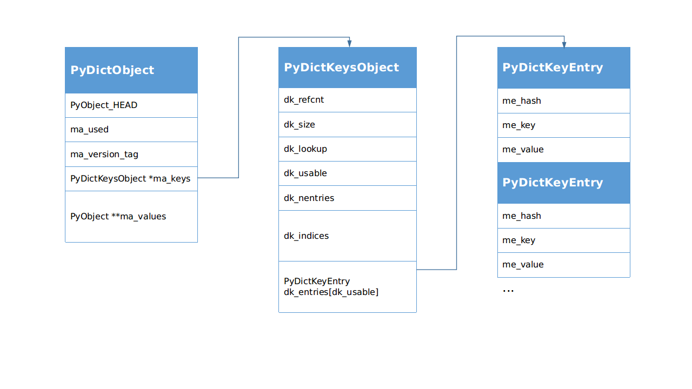

# 细说 PEP 468: Preserving Keyword Argument Order

 Python 3.6.0 版本对字典做了优化，新的字典速度更快，占用内存更少，非常神奇。从网上找了资料来看，大部分都指向了 [[Python-Dev] More compact dictionaries with faster iteration](https://mail.python.org/pipermail/python-dev/2012-December/123028.html) 这篇文章，里面概括性地介绍了旧字典和新字典的差别，以及优化的地方，很有创意。

然而我非常好奇这样的结构是怎么用C语言实现的，所以去看了源码。我分别找到 3.5.9 和 3.6.0 版本的 Python 字典源代码，对比了一下，发现 Python 里字典的实现到处都是神操作，令人振奋。于是，一个想法产生了，不如就从源码角度，细说一下 PEP 468 对字典的改进，也算是对  [[Python-Dev] More compact dictionaries with faster iteration](https://mail.python.org/pipermail/python-dev/2012-December/123028.html) 的补充。

如果上来就对比 3.5.9 和 3.6.0 的代码差异，是没有办法把事情说清楚的，所以我还得多啰嗦一些，把字典数据结构先完整地分析一下，然后就可以愉快地对比差异了 : ) 

如无特殊说明，默认参考`Python 3.6.0`版本。

## 新特性

在 Python 的新特性变更记录页面，可以看到 Python 从 3.6 版本开始，支持有序字典，而且内存占用更少。

> ## Python 3.6.0 beta 1
>
> *Release date: 2016-09-12*
>
> ### Core and Builtins
>
> - ...
> - [bpo-27350](https://bugs.python.org/issue27350): [`dict`](https://docs.python.org/3.6/library/stdtypes.html#dict) implementation is changed like PyPy. It is more compact and preserves insertion order. (Concept developed by Raymond Hettinger and patch by Inada Naoki.)
> - ...

## dict 数据结构简述

我本来想拿 Python 3.5.9 的结构来对比一下，不过后来想了想，没有必要。二者差异不大，不需要把对比搞得很麻烦，我直接介绍 Python 3.6.0 的字典结构，然后直接对比源码细节，就已经够清楚了。再参考 [[Python-Dev] More compact dictionaries with faster iteration](https://mail.python.org/pipermail/python-dev/2012-December/123028.html)  ，就更清晰了。

### 结构

涉及到字典对象的结构主要有3个：

- `PyDictObject` (./Include/dictobject.h)
- `PyDictKeysObject` (./Objects/dict-common.h) 就是头文件里面的 `struct _dictkeysobject`
- `PyDictKeyEntry` (./Objects/dict-common.h)



下面依次说明一下各个数据的定义：

- `PyDictObject` 

  字典对象，Python里面所有字典，不管是我们自己用`dict()`创建的还是类的`__dict__`属性，都是它。

  - `PyObject_HEAD`

    Python里所有东西都是对象，而且这些对象都是无类型的，那么想想这两个问题：在C语言里，类型是固定的，而且没有运行时类型检查，那么怎么样实现动态调用呢？动态调用以后怎么识别类型呢？

    没错，就是"看脸"，假如每个对象都有一个这样的`PyObject_HEAD`，其中包含类型信息，那么就可以用指针动态调用，然后根据其中的类型信息动态识别类型了。~~打个比方，假如你的对象很多很多，TA们的身高体重长相各自都是固定的，你今天约这个，明天约那个，“类型”变了怎么办？不碍事呀，用手机“动态调用”，听声音或者见面“识别类型”，一个道理嘛，哈哈哈哈哈哈哈……~~

    再多说一句，一定要做好“类型检查”，~~如果让你的对象发现你心里想的是别人，那就翻车了！这时候程序就出错崩溃了！~~
  
  - `ma_used`
  
    当前字典里的`item`数量。
  
  - `ma_version_tag`
  
    有一个64位无符号全局变量`pydict_global_version`，字典的创建和每次更改，都会给这个全局变量+1，然后**赋值(不是引用)**给`ma_version_tag`。所以在不同的时刻，只需要看`ma_version_tag`变没变，就知道字典变没变，不需要检查字典的内容。这个特性可以优化程序。参考 [PEP 509 -- Add a private version to dict](https://www.python.org/dev/peps/pep-0509/)
  
  - `PyDictKeysObject *ma_keys`

    字典的键对象指针，虽然这个对象叫`KeysObject`，但是里面也有`value`，在"combined"模式下`value(即 me_value)`有效；而在"splitted"模式下`me_value`无效，改用`PyObject **ma_values`。
  
    - `dk_refcnt`
  
      在"splitted"模式下，一个`PyDictKeysObject`被很多`PyDictObject`共用，这个引用计数就起作用了。
  
    - <span id="dk_size">`dk_size`</span>
  
      字典哈希表空间大小，指实际申请的内存空间，类似C++里`vector`的`capacity`属性的含义。
  
      这个值也是数组`dk_indices`的大小，**必须是 2 的整数次幂**，不够用时再动态扩容。
  
      不过为什么必须是 2 的整数次幂？我摘出来几行代码。
  
      ```c
      #define DK_MASK(dk) (((dk)->dk_size)-1)
      size_t mask = DK_MASK(k);
      i = (size_t)hash & mask;	// 通过哈希值计算哈希表索引
      ```
  
      这就明白了，哈希值的数据类型是`size_t`，可能导致哈希表访问越界，所以要对哈希表长度取余数，为了用与操作加速取余数运算，把`dk_size`规定为 2 的整数次幂。
  
    - <span id="dk_lookup">`dk_lookup`</span>
  
      查找函数，从哈希表中找出指定元素。共有4个函数。
  
      > /* Function to lookup in the hash table (dk_indices):
      > ​       \- lookdict(): general-purpose, and may return DKIX_ERROR if (and
      > ​         only if) a comparison raises an exception.
      >
      > ​       \- lookdict_unicode(): specialized to Unicode string keys, comparison of
      > ​         which can never raise an exception; that function can never return
      > ​         DKIX_ERROR.
      >
      > ​       \- lookdict_unicode_nodummy(): similar to lookdict_unicode() but further
      > ​         specialized for Unicode string keys that cannot be the <dummy> value.
      >
      > ​       \- lookdict_split(): Version of lookdict() for split tables. */
      
      Python 里大量用到以字符串作为`key`的字典，所以对它做了专门的优化，尽量多用字符串作为`key`吧！
  
    - `dk_usable`
  
      字典里的可用`entry(hash-key-value)`数量，为了降低哈希碰撞，只占`dk_size`的`2/3`，由`USABLE_FRACTION`宏设置。
  
      这个值在初始化时也是数组`dk_entries`或`ma_values`的大小，不够用时再动态扩容。
  
    - `dk_nentries`
  
      数组`dk_entries`或`ma_values`的已用`entry`数量。
  
    - `dk_indices`
  
      哈希索引表数组，它是一个哈希表，但是存储的内容是`dk_entries`里元素的索引。
  
      参考 [PEP 468 -- Preserving the order of **kwargs in a function.](https://www.python.org/dev/peps/pep-0468/)
  
    - <span id="dk_entries">`PyDictKeyEntry dk_entries[dk_usable]`</span>
      
      Python 里管一个`hash-key-value`的组合叫一个`entry`，这个概念会经常出现。注意它和[`ma_values`](#ma_values)的区别，`dk_entries`是一个数组，存储区域紧跟在`dk_indices`后面，而`ma_values`是一个指针，指向的存储区域并不在`PyDictObject`末尾。在分析`dictresize()`函数的时候，会看到这个特性带来的影响。
      
      - `me_hash`
      - `me_key`
      - `me_value`
      
    - ...(下一个`PyDictKeyEntry`)
  
  - <span id="ma_values">`PyObject **ma_values`</span>
  
    Python 3.3 引入了新的字典实现方式: `splitted dict`，这是一个针对类属性实现的结构，想象这样的应用场景：一个类，定义好以后属性名字不变(假设不动态更改)，它有很多不同的实例，这些实例属性值不同，但是属性名字相同，如果这些`__dict__`共用一套`key`，可以节约内存。参考 [PEP 412 -- Key-Sharing Dictionary](https://www.python.org/dev/peps/pep-0412/)
    
    在这个模式下，多个不同的`PyDictObject`对象里面的`ma_keys`指针指向同一个`PyDictKeysObject`对象。原来的字典里的**`entry(hash-key-value)`是一个整体，牵一发而动全身**，现在`key`合并了，也就意味着`entry`合并了，所以`value`也被迫合并了，但是我们不能让`value`合并，因为这种模式下不同的`PyDictKeysObject`对象的`key`一样，但是`value`不一样，没有办法，就只好在`entry`结构外面添加`value`数组，代替被迫合并的`entry->value`，这个外加的`value`数组就分别附加到多个不同的`PyDictObject`对象后面。这个做法分开了`key`和`value`，所以取名"splitted"
    
    > /* If ma_values is NULL, the table is "combined": keys and values
    > ​       are stored in ma_keys.
    >
    > ​       If ma_values is not NULL, the table is splitted:
    > ​       keys are stored in ma_keys and values are stored in ma_values */
    >
    > PyObject **ma_values;
    
    此外，“splitted”模式还有2个条件，与类属性吻合：
    
    > Only string (unicode) keys are allowed.
    >  All dicts sharing same key must have same insertion order.

### 源码

把 Python 3.5.9 版本和 3.6.0 版本的结构体拿出来对比一下，Python 3.6.0 加了很多在 Python 3.5.9 里面没有的注释，非常优秀的行为！！不过这里只保留了不同部分的注释。

```c
/* ./Objects/dict-common.h */
/* Python 3.5.9 */
struct _dictkeysobject {
    Py_ssize_t dk_refcnt;
    Py_ssize_t dk_size;
    dict_lookup_func dk_lookup;
    Py_ssize_t dk_usable;
    PyDictKeyEntry dk_entries[1];
};

/* Python 3.6.0 */
struct _dictkeysobject {
    Py_ssize_t dk_refcnt;
    Py_ssize_t dk_size;
    dict_lookup_func dk_lookup;
    Py_ssize_t dk_usable;
    
    /* Number of used entries in dk_entries. */
    Py_ssize_t dk_nentries;

    /* Actual hash table of dk_size entries. It holds indices in dk_entries,
       or DKIX_EMPTY(-1) or DKIX_DUMMY(-2).

       Indices must be: 0 <= indice < USABLE_FRACTION(dk_size).

       The size in bytes of an indice depends on dk_size:

       - 1 byte if dk_size <= 0xff (char*)
       - 2 bytes if dk_size <= 0xffff (int16_t*)
       - 4 bytes if dk_size <= 0xffffffff (int32_t*)
       - 8 bytes otherwise (int64_t*)

       Dynamically sized, 8 is minimum. */
    union {
        int8_t as_1[8];
        int16_t as_2[4];
        int32_t as_4[2];
#if SIZEOF_VOID_P > 4
        int64_t as_8[1];
#endif
    } dk_indices;

    /* "PyDictKeyEntry dk_entries[dk_usable];" array follows:
       see the DK_ENTRIES() macro */
};
```

通过注释可以知道这些新添加的变量的用途，不过在结构体里面，`dk_entries`的定义注释掉了，这是怎么回事呢？根据注释的指引，找到`DK_ENTRIES`一探究竟。

```c
/* Python 3.6.0 */
/* ./Objects/dictobject.c */
#define DK_SIZE(dk) ((dk)->dk_size)
#if SIZEOF_VOID_P > 4
#define DK_IXSIZE(dk)                          \
    (DK_SIZE(dk) <= 0xff ?                     \
        1 : DK_SIZE(dk) <= 0xffff ?            \
            2 : DK_SIZE(dk) <= 0xffffffff ?    \
                4 : sizeof(int64_t))
#else
#define DK_IXSIZE(dk)                          \
    (DK_SIZE(dk) <= 0xff ?                     \
        1 : DK_SIZE(dk) <= 0xffff ?            \
            2 : sizeof(int32_t))
#endif
#define DK_ENTRIES(dk) \
    ((PyDictKeyEntry*)(&(dk)->dk_indices.as_1[DK_SIZE(dk) * DK_IXSIZE(dk)]))
```

- `DK_SIZE`取得[`dk_size`](#dk_size)，也就是数组`dk_indices`的元素数量
- `DK_IXSIZE`根据`dk_size`设置当前`dk_indices`每个元素占用的字节数
- `DK_ENTRIES`根据`dk`对象(`PyDictKeysObject`对象)取得`dk_entries`数组首地址

于是，`dk_indices.as_1[DK_SIZE(dk) * DK_IXSIZE(dk)]`就会定位到`dk_indices`后面的第一个地址，也就是`dk_indices`刚好越界的地方。什么？越界？对，因为后面紧跟着的就是`dk_entries`对应的空间，`DK_ENTRIES`宏取得的这个地址就是`dk_entries`数组的首地址。多么有趣的玩法 : )

为什么要搞这么麻烦呢？像 Python 3.5.9 里面那样直接定义`dk_entries`不好吗？我想这大概是因为`dk_indices`也是动态的。如果直接定义`dk_entries`，那它的首地址相对结构体而言就是固定的，当`dk_indices`数组长度动态变化的时候，使用`&dk->dk_entries[0]`这样的语句就会得到错误的地址。具体的内存分布还需要看`new_keys_object()`函数。

## 为什么小

接着上面的内容，分析`new_keys_object()`函数，从这里可以看到`PyDictKeysObject`对象的内存分布。我在关键位置加了注释，省略一些不影响理解流程的代码。

```c
/* Python 3.6.0 */
/* ./Objects/dictobject.c */
...
/* Get the size of a structure member in bytes */
#define Py_MEMBER_SIZE(type, member) sizeof(((type *)0)->member)
...
static PyDictKeysObject *new_keys_object(Py_ssize_t size)
{
    PyDictKeysObject *dk;
    Py_ssize_t es, usable;
    
    assert(size >= PyDict_MINSIZE);
    assert(IS_POWER_OF_2(size));
    
    // dk_indices 有 2/3 能用(usable), 1/3 不使用
    // PyDictKeyEntry dk_entries[dk_usable] 只申请 usable 部分内存
    usable = USABLE_FRACTION(size);     // 2/3
    if (size <= 0xff) {
        es = 1;     // 字节数
    }
    else if (size <= 0xffff) {
        ...
    }

    // 为 PyDictKeysObject *dk 申请内存
    // 使用缓存池
    if (size == PyDict_MINSIZE && numfreekeys > 0) {
        dk = keys_free_list[--numfreekeys];
    }
    else {
        dk = PyObject_MALLOC(// Py_MEMBER_SIZE 得到 dk_indices 之前的大小
                             sizeof(PyDictKeysObject)
                             - Py_MEMBER_SIZE(PyDictKeysObject, dk_indices)
                             // 字节数 * dk_indices元素数量
                             + es * size
                             // PyDictKeyEntry dk_entries[dk_usable]
                             // 这部分内容没有在 struct _dictkeysobject 结构体里定义，但是实际申请了空间
                             // 因为 dk_indices 长度也是可变的，所以使用 DK_ENTRIES 宏来操作 dk_entries
                             // 为了节约空间，只申请 usable 部分，所以 dk_indices 比 dk_entries 长
                             + sizeof(PyDictKeyEntry) * usable);
        ...
    }
    DK_DEBUG_INCREF dk->dk_refcnt = 1;
    dk->dk_size = size;
    dk->dk_usable = usable;
    dk->dk_lookup = lookdict_unicode_nodummy;
    dk->dk_nentries = 0;
    // dk_indices 初始化为0xFF 对应 #define DKIX_EMPTY (-1)
    memset(&dk->dk_indices.as_1[0], 0xff, es * size);
    // dk_entries 初始化为 0
    // DK_ENTRIES 宏用于定位 dk_entries，相当于 &dk->dk_entries[0]
    memset(DK_ENTRIES(dk), 0, sizeof(PyDictKeyEntry) * usable);
    return dk;
}
```

`PyObject_MALLOC`申请到的内存，就是这个字典的`PyDictKeysObject`对象，这个结构体内存可以分为3部分：

1. `dk_indices`之前的部分：`sizeof(PyDictKeysObject) - Py_MEMBER_SIZE(PyDictKeysObject, dk_indices)`

   用头文件定义的结构体大小减去`dk_indices`的大小，就是`dk_indices`之前的部分，包含`dk_refcnt, dk_size, dk_lookup,  dk_usable, dk_nentries`

2. `dk_indices`：`es * size`

   字节数 * dk_indices元素数量。

3. `dk_entries`：`sizeof(PyDictKeyEntry) * usable)`

   从这里可以看到，`dk_entries`的长度不是`size`，只申请 usable 部分。

再对比一下 Python 3.5.9 的`dk = PyMem_MALLOC(...)`内存申请和`dk_entries`寻址，就可以明白二者巨大的差异。

```c
/* Python 3.5.9 */
/* ./Objects/dictobject.c */
static PyDictKeysObject *new_keys_object(Py_ssize_t size)
{
    PyDictKeysObject *dk;
    Py_ssize_t i;
    PyDictKeyEntry *ep0;
    ...
    dk = PyMem_MALLOC(sizeof(PyDictKeysObject) +
                      // 结构体里面 PyDictKeyEntry dk_entries[1] 加上这里 size-1，共size个
                      sizeof(PyDictKeyEntry) * (size-1));
    ...
    ep0 = &dk->dk_entries[0];
    /* Hash value of slot 0 is used by popitem, so it must be initialized */
    ep0->me_hash = 0;
    for (i = 0; i < size; i++) {
        ep0[i].me_key = NULL;
        ep0[i].me_value = NULL;
    }
    dk->dk_lookup = lookdict_unicode_nodummy;
    return dk;
}
```

对比一下这 2 个`PyObject_MALLOC()`函数申请的内存空间，就知道为什么新的字典占用内存更少了。

分析完内存布局， PEP 468 的改进就非常清晰了，现在可以对照 PEP 468 提供的资料确认一下，如果有一种豁然开朗的感觉，那就对了；~~如果没有，可能是茂密的头发阻碍了你变强，建议剃光~~。跟随 PEP 468 说明链接找到 [[Python-Dev] More compact dictionaries with faster iteration](https://mail.python.org/pipermail/python-dev/2012-December/123028.html) ，里面描述的第一个`entries`数组对应 3.5.9 版本的`dk_entries`；后面的`indices`和`entries`对应 3.6.0 版本的`dk_indices`和`dk_entries`数组，跟上面的代码对上了。

> The current memory layout for dictionaries is unnecessarily inefficient.  It has a sparse table of 24-byte entries containing the hash value, key pointer, and value pointer.
>
> Instead, the 24-byte entries should be stored in a dense table referenced by a sparse table of indices.
>
> For example, the dictionary:
>
>     d = {'timmy': 'red', 'barry': 'green', 'guido': 'blue'}
>
> is currently stored as:
>
>     entries = [['--', '--', '--'],
>                [-8522787127447073495, 'barry', 'green'],
>                ['--', '--', '--'],
>                ['--', '--', '--'],
>                ['--', '--', '--'],
>                [-9092791511155847987, 'timmy', 'red'],
>                ['--', '--', '--'],
>                [-6480567542315338377, 'guido', 'blue']]
>
> Instead, the data should be organized as follows:
>
>     indices =  [None, 1, None, None, None, 0, None, 2]
>     entries =  [[-9092791511155847987, 'timmy', 'red'],
>                 [-8522787127447073495, 'barry', 'green'],
>                 [-6480567542315338377, 'guido', 'blue']]
>
> Only the data layout needs to change.  The hash table algorithms would stay the same.  All of the current optimizations would be kept, including key-sharing dicts and custom lookup functions for string-only dicts.  There is no change to the hash functions, the table search order, or collision statistics.

看完源码，对这个说明的理解就更加深刻了吧，嘿嘿 : )

不过，到这里还没完，`new_keys_object()`函数只是创建了`PyDictKeysObject`对象，最终目标应该是`PyDictObject`，创建`PyDictObject`对象的函数是`PyDict_New()`

```c
/* Python 3.6.0 */
/* ./Objects/dictobject.c */
PyObject *
PyDict_New(void)
{
    PyDictKeysObject *keys = new_keys_object(PyDict_MINSIZE);
    if (keys == NULL)
        return NULL;
    return new_dict(keys, NULL);	// combined 模式下 values 是 NULL
}
```

`new_keys_object()`看过了，接着看看`new_dict()`，仍然省略掉部分类型检查和异常检查代码。

```c
/* Python 3.6.0 */
/* ./Objects/dictobject.c */
static PyObject *
new_dict(PyDictKeysObject *keys, PyObject **values)
{
    PyDictObject *mp;
    assert(keys != NULL);
    if (numfree) {
        // 缓存池
        mp = free_list[--numfree];
        ...
        _Py_NewReference((PyObject *)mp);
    }
    else {
        mp = PyObject_GC_New(PyDictObject, &PyDict_Type);
        ...
    }
    mp->ma_keys = keys;			// 传递 new_keys_object 函数生成的 PyDictKeysObject 对象
    mp->ma_values = values;		// combined 模式下 values 是 NULL
    mp->ma_used = 0;			// 初始化的字典没有元素
    mp->ma_version_tag = DICT_NEXT_VERSION();	// 版本号，参考上面数据结构里的说明
    assert(_PyDict_CheckConsistency(mp));
    return (PyObject *)mp;
}
```

到这里，一个 dict 对象就算正式创建完成了，我们在 Python 里也可以开始愉快地玩耍了。不过注意，这里创建出来的字典是“combined”模式的。“splitted”模式的字典在“combined”模式基础上还初始化了`ma_values`，我这里就懒得详细介绍了。

## 为什么有序

通过前面分析的数据结构，我们知道，字典元素保存在`dk_entries`数组中。当一个数据结构有序，指的是它里面元素的顺序与插入顺序相同。元素插入哈希表的索引是哈希函数算出来的，应该是无序的，这就是之前的字典元素无序的原因。而 Python 3.6.0 引入了`dk_indices`数组，专门记录哈希表信息，那么元素插入的顺序信息就得以保留在`dk_entries`数组中。为了满足好奇心，下面分析一下插入函数。

```c
/* Python 3.6.0 */
/* ./Objects/dictobject.c */
/*
Internal routine to insert a new item into the table.
Used both by the internal resize routine and by the public insert routine.
Returns -1 if an error occurred, or 0 on success.
*/
static int
insertdict(PyDictObject *mp, PyObject *key, Py_hash_t hash, PyObject *value)
{
    PyObject *old_value;
    PyObject **value_addr;
    PyDictKeyEntry *ep, *ep0;
    Py_ssize_t hashpos, ix;
	...
    ix = mp->ma_keys->dk_lookup(mp, key, hash, &value_addr, &hashpos);
    ...
    Py_INCREF(value);
    MAINTAIN_TRACKING(mp, key, value);
	...
	/* 插入新值 */
    if (ix == DKIX_EMPTY) {
        /* Insert into new slot. */
        /* dk_entries 数组填满的时候给字典扩容 */
        if (mp->ma_keys->dk_usable <= 0) {
            /* Need to resize. */
            if (insertion_resize(mp) < 0) {
                Py_DECREF(value);
                return -1;
            }
            find_empty_slot(mp, key, hash, &value_addr, &hashpos);
        }
        ep0 = DK_ENTRIES(mp->ma_keys);
        ep = &ep0[mp->ma_keys->dk_nentries];	// 每次插入位置在最后
        dk_set_index(mp->ma_keys, hashpos, mp->ma_keys->dk_nentries);
        Py_INCREF(key);
        ep->me_key = key;
        ep->me_hash = hash;
        if (mp->ma_values) {
            assert (mp->ma_values[mp->ma_keys->dk_nentries] == NULL);
            mp->ma_values[mp->ma_keys->dk_nentries] = value;
        }
        else {
            ep->me_value = value;
        }
        mp->ma_used++;
        mp->ma_version_tag = DICT_NEXT_VERSION();
        mp->ma_keys->dk_usable--;
        mp->ma_keys->dk_nentries++;
        assert(mp->ma_keys->dk_usable >= 0);
        assert(_PyDict_CheckConsistency(mp));
        return 0;
    }

    assert(value_addr != NULL);
	/* 替换旧值 */
    old_value = *value_addr;
    if (old_value != NULL) {
        *value_addr = value;
        mp->ma_version_tag = DICT_NEXT_VERSION();
        assert(_PyDict_CheckConsistency(mp));

        Py_DECREF(old_value); /* which **CAN** re-enter (see issue #22653) */
        return 0;
    }

    /* pending state */
    assert(_PyDict_HasSplitTable(mp));
    assert(ix == mp->ma_used);
    *value_addr = value;
    mp->ma_used++;
    mp->ma_version_tag = DICT_NEXT_VERSION();
    assert(_PyDict_CheckConsistency(mp));
    return 0;
}
```

在插入函数中，第一个重点关注对象应该是`ix = mp->ma_keys->dk_lookup(mp, key, hash, &value_addr, &hashpos)`这句代码。[`dk_lookup`](#dk_lookup)是一个函数指针，指向四大搜索函数的其中一个，这里有必要说明一下各参数和返回值：

- 参数

  1. `PyDictObject *mp` (已知参数)

     字典对象，在该对象中查找。

  2. `PyObject *key` (已知参数)

     `entry`里的`key`，代表`key`对象的引用，用于第一次判定，如果引用相同就找到了；如果不同再判断`hash`

  3. `Py_hash_t hash` (已知参数)

     `entry`里的`hash`，用于第二次判定，如果哈希值相同就找到了；如果不同就代表没找到。

  4. `PyObject ***value_addr` (未知参数，用指针返回数据)

     如果找到元素，则`value_addr`返回对应的`me_value`的指针；如果没找到，`*value_addr`为`NULL`

  5. `Py_ssize_t *hashpos` (未知参数，用指针返回数据)

     `hashpos`返回元素在哈希表中的位置。

- 返回值

  - `Py_ssize_t ix`

    返回元素在`dk_entries`数组中的索引。如果不是有效元素，`ix`可能是`DKIX_EMPTY, DKIX_DUMMY, DKIX_ERROR`中的一个，分别代表`dk_entries`数组中的 新空位，删除旧值留下的空位，错误。

了解了各个参数的作用，就可以继续愉快地看代码了。然后就看到了这一句`ep = &ep0[mp->ma_keys->dk_nentries]`，根据它下面的代码可以知道，这个`ep`就是新元素插入的地方，代表一个`PyDictKeyEntry`对象指针，而`mp->ma_keys->dk_nentries`指向的位置，就是`dk_entries`数组的末尾。也就是说，每次的新元素插入字典，都会依次放到`dk_entries`数组里，保持了插入顺序。那么哈希函数计算出来的插入位置呢？答案就在`dk_set_index(mp->ma_keys, hashpos, mp->ma_keys->dk_nentries)`函数里。

```c
/* Python 3.6.0 */
/* ./Objects/dictobject.c */
/* write to indices. */
static inline void
dk_set_index(PyDictKeysObject *keys, Py_ssize_t i, Py_ssize_t ix)
{
    Py_ssize_t s = DK_SIZE(keys);

    assert(ix >= DKIX_DUMMY);

    if (s <= 0xff) {
        int8_t *indices = keys->dk_indices.as_1;
        assert(ix <= 0x7f);
        indices[i] = (char)ix;	// 填充 dk_indices 数组
    }
    else if (s <= 0xffff) {
        ...
    }
}
```

可以看到，哈希函数计算出来的插入位置保存到了`dk_indices`数组里，而对应插入位置保存的信息就是这个元素在`dk_entries`数组里的索引。
如果没看明白，就再回顾一下 [[Python-Dev] More compact dictionaries with faster iteration](https://mail.python.org/pipermail/python-dev/2012-December/123028.html) 中的描述。

> For example, the dictionary:
>
>  d = {'timmy': 'red', 'barry': 'green', 'guido': 'blue'}
>
> ...
>
> Instead, the data should be organized as follows:
>
>  indices =  [None, 1, None, None, None, 0, None, 2]
>  entries =  [[-9092791511155847987, 'timmy', 'red'],
>              [-8522787127447073495, 'barry', 'green'],
>              [-6480567542315338377, 'guido', 'blue']]

是时候了，现在拿出 Python 3.5.9 的代码对比一下，只对比 Empty 状态的 slot 插入代码即可。

```c
/* Python 3.5.9 */
/* ./Objects/dictobject.c */
/*
Internal routine to insert a new item into the table.
Used both by the internal resize routine and by the public insert routine.
Returns -1 if an error occurred, or 0 on success.
*/
static int
insertdict(PyDictObject *mp, PyObject *key, Py_hash_t hash, PyObject *value)
{
    PyObject *old_value;
    PyObject **value_addr;
    PyDictKeyEntry *ep;
    assert(key != dummy);

    Py_INCREF(key);
    Py_INCREF(value);
    ...
    ep = mp->ma_keys->dk_lookup(mp, key, hash, &value_addr);
    ...
    old_value = *value_addr;
    /* Active 状态 */
    if (old_value != NULL) {
        ...
    }
    else {
        /* Empty 状态 */
        if (ep->me_key == NULL) {
            if (mp->ma_keys->dk_usable <= 0) {
                /* Need to resize. */
                ...
            }
            mp->ma_used++;
            *value_addr = value;	// 直接向 dk_entries 数组插入元素
            mp->ma_keys->dk_usable--;
            assert(mp->ma_keys->dk_usable >= 0);
            ep->me_key = key;
            ep->me_hash = hash;
            assert(ep->me_key != NULL && ep->me_key != dummy);
        }
        /* Dummy 状态 */
        else {
            ...
        }
    }
    return 0;
    ...
}
```

可以看到`*value_addr = value`这句代码填充了`dk_entries`，但是这里信息是不够的，`value_addr`来自搜索函数，于是我找到通用搜索函数`lookdict`，来看下它里面获取插入位置的关键代码。

```c
/* Python 3.5.9 */
/* ./Objects/dictobject.c */
static PyDictKeyEntry *
lookdict(PyDictObject *mp, PyObject *key,
         Py_hash_t hash, PyObject ***value_addr)
{
    ...
    mask = DK_MASK(mp->ma_keys);
    ep0 = &mp->ma_keys->dk_entries[0];
    i = (size_t)hash & mask;	// 靠哈希值找到插入位置
    ep = &ep0[i];	// 直接按照位置插入到 dk_entries 数组中
    if (ep->me_key == NULL || ep->me_key == key) {
        *value_addr = &ep->me_value;	// 用指针返回 me_value 作为插入地址
        return ep;
    }
    ...
}
```

可以清晰地看到，哈希函数计算出来的位置是直接对应到`dk_entries`数组中的，元素也直接放进去，没有`dk_indices`数组。因为哈希值不是连续的，所以我们依次插入到`dk_entries`数组里的元素也就不连续了。
如果又没看明白，就再回顾一下 [[Python-Dev] More compact dictionaries with faster iteration](https://mail.python.org/pipermail/python-dev/2012-December/123028.html) 中的描述。

> For example, the dictionary:
> 
>     d = {'timmy': 'red', 'barry': 'green', 'guido': 'blue'}
> 
> is currently stored as:
> 
>     entries = [['--', '--', '--'],
>                [-8522787127447073495, 'barry', 'green'],
>                ['--', '--', '--'],
>                ['--', '--', '--'],
>                ['--', '--', '--'],
>                [-9092791511155847987, 'timmy', 'red'],
>                ['--', '--', '--'],
>                [-6480567542315338377, 'guido', 'blue']]


## 为什么快

迭代变快的原因源自`dk_entries`数组的密集化，迭代时遍历的数量少。Python 3.5.9 和 3.6.0 版本代码的写法差异不大，所以这里只摘取一段`dictresize()`的数据复制代码对比。对`dictresize()`函数的具体分析放在附录里。

```c
/* ./Objects/dictobject.c */
/* Python 3.5.9 */
static int
dictresize(PyDictObject *mp, Py_ssize_t minused)
{
    ...
    /* Main loop */
    for (i = 0; i < oldsize; i++) {
        PyDictKeyEntry *ep = &oldkeys->dk_entries[i];
        if (ep->me_value != NULL) {
            assert(ep->me_key != dummy);
            insertdict_clean(mp, ep->me_key, ep->me_hash, ep->me_value);
        }
    }
    mp->ma_keys->dk_usable -= mp->ma_used;
    ...
}
/* Python 3.6.0 */
static int
dictresize(PyDictObject *mp, Py_ssize_t minsize)
{
    ...
    /* Main loop */
    for (i = 0; i < oldkeys->dk_nentries; i++) {
        PyDictKeyEntry *ep = &ep0[i];
        if (ep->me_value != NULL) {
            insertdict_clean(mp, ep->me_key, ep->me_hash, ep->me_value);
        }
    }
    mp->ma_keys->dk_usable -= mp->ma_used;
    ...
}
```


现在知道是哪些代码节省了时间吗？就是所有`for (i = 0; i < oldkeys->dk_nentries; i++){...}`代码块。在 Python 3.5.9 中，它们对应`for (i = 0; i < oldsize; i++){...}`，其中的`oldsize`等于`oldkeys->dk_size`，只看代码的写法，没有什么区别，但是根据`USABLE_FRACTION`的设置，`dk_nentries`只占`dk_size`的`2/3`，所以新的字典迭代次数少了`1/3`。在`dict_items()`函数中的迭代操作速度变快也是同样的原因。

现在再来看看 [[Python-Dev] More compact dictionaries with faster iteration](https://mail.python.org/pipermail/python-dev/2012-December/123028.html) 里面的这几段话：

> In addition to space savings, the new memory layout makes iteration faster.  Currently, keys(), values, and items() loop over the sparse table, skipping-over free slots in the hash table.  Now, keys/values/items can loop directly over the dense table, using fewer memory accesses.
>
> Another benefit is that resizing is faster and touches fewer pieces of memory.  Currently, every hash/key/value entry is moved or copied during a resize.  In the new layout, only the indices are updated.  For the most part, the hash/key/value entries never move (except for an occasional swap to fill a hole left by a deletion).
>
> With the reduced memory footprint, we can also expect better cache utilization.


## 源码观后感

Python 的字典实现就是一套 tradeoff 的艺术，有太多的东西值得深思：

- 使用空间占申请空间的比重
- 哈希函数和探测函数的选用
- 初始化需要申请的最小空间
- 字典扩容时扩到多少
- 元素分布对 CPU 缓存的影响

目前 Python 里的各个参数都是通过大量测试得到的，考虑的场景很全面。然而，tradeoff 的艺术，也包括针对特定应用场景优化，如果能根据实际业务场景优化 Python 参数，性能还是可以提高的。

此外，几个性能优化的点：

- 缓存池只缓存小对象，大容量的字典的创建和扩容每次都要重新申请内存。多小算小呢？

  > \#define PyDict_MINSIZE 8
  >
  > 8 allows dicts with no more than 5 active entries.

- 鉴于`lookdict_unicode()`函数的存在，尽量用字符串作为`key`

参考`./Objects/dictnotes.txt`及`./Objects/dictobject.c`里的部分注释。

## 参考资料

- 《Python源码剖析》
- [关于python3.6中dict如何保证有序](https://zhuanlan.zhihu.com/p/36167600)
- [[Python-Dev] More compact dictionaries with faster iteration](https://mail.python.org/pipermail/python-dev/2012-December/123028.html)
- [PEP 468 -- Preserving the order of **kwargs in a function.](https://www.python.org/dev/peps/pep-0468/)
- [PEP 468: Preserving Keyword Argument Order](https://docs.python.org/3.6/whatsnew/3.6.html#pep-468-preserving-keyword-argument-order)
- [issue27350](https://bugs.python.org/issue27350)

### 需要科学上网

- [https://morepypy.blogspot.hk/2015/01/faster-more-memory-efficient-and-more.html](https://morepypy.blogspot.hk/2015/01/faster-more-memory-efficient-and-more.html)
- http://python-weekly.blogspot.com/2017/01/20-best-python-questions-at.html

## 附录
### dict 扩容源码分析

扩容操作发生在元素插入的时候，当`mp->ma_keys->dk_usable <= 0`的时候，就对字典扩容，新容量使用`GROWTH_RATE`宏计算。`dictresize()`函数处理"combined"和"splitted"两种情况，需要分开看。

```c
/* Python 3.6.0 */
/* ./Objects/dictobject.c */
/* GROWTH_RATE. Growth rate upon hitting maximum load.
 * Currently set to used*2 + capacity/2.
 * This means that dicts double in size when growing without deletions,
 * but have more head room when the number of deletions is on a par with the
 * number of insertions.
 * Raising this to used*4 doubles memory consumption depending on the size of
 * the dictionary, but results in half the number of resizes, less effort to
 * resize.
 * GROWTH_RATE was set to used*4 up to version 3.2.
 * GROWTH_RATE was set to used*2 in version 3.3.0
 */
#define GROWTH_RATE(d) (((d)->ma_used*2)+((d)->ma_keys->dk_size>>1))

/*
Restructure the table by allocating a new table and reinserting all
items again.  When entries have been deleted, the new table may
actually be smaller than the old one.
If a table is split (its keys and hashes are shared, its values are not),
then the values are temporarily copied into the table, it is resized as
a combined table, then the me_value slots in the old table are NULLed out.
After resizing a table is always combined,
but can be resplit by make_keys_shared().
*/
static int
dictresize(PyDictObject *mp, Py_ssize_t minsize)
{
    Py_ssize_t i, newsize;
    PyDictKeysObject *oldkeys;
    PyObject **oldvalues;
    PyDictKeyEntry *ep0;

    /* Find the smallest table size > minused. */
    /* 1. 计算新大小 */
    for (newsize = PyDict_MINSIZE;
         newsize < minsize && newsize > 0;
         newsize <<= 1)
        ;
    if (newsize <= 0) {
        PyErr_NoMemory();
        return -1;
    }
    /* 2. 申请新的 PyDictKeysObject 对象 */
    oldkeys = mp->ma_keys;
    oldvalues = mp->ma_values;
    /* Allocate a new table. */
    mp->ma_keys = new_keys_object(newsize);
    if (mp->ma_keys == NULL) {
        mp->ma_keys = oldkeys;
        return -1;
    }
    // New table must be large enough.
    assert(mp->ma_keys->dk_usable >= mp->ma_used);
    if (oldkeys->dk_lookup == lookdict)
        mp->ma_keys->dk_lookup = lookdict;
    /* 3. 元素搬迁 */
    mp->ma_values = NULL;
    ep0 = DK_ENTRIES(oldkeys);
    /* Main loop below assumes we can transfer refcount to new keys
     * and that value is stored in me_value.
     * Increment ref-counts and copy values here to compensate
     * This (resizing a split table) should be relatively rare */
    if (oldvalues != NULL) {
        /* 3.1 splitted table 转换成 combined table */
        for (i = 0; i < oldkeys->dk_nentries; i++) {
            if (oldvalues[i] != NULL) {
                Py_INCREF(ep0[i].me_key);	// 要复制key，而原来的key也要用，所以增加引用计数
                ep0[i].me_value = oldvalues[i];
            }
        }
    }
    /* Main loop */
    for (i = 0; i < oldkeys->dk_nentries; i++) {
        PyDictKeyEntry *ep = &ep0[i];
        if (ep->me_value != NULL) {
            insertdict_clean(mp, ep->me_key, ep->me_hash, ep->me_value);
        }
    }
    mp->ma_keys->dk_usable -= mp->ma_used;
    /* 4. 清理旧值 */
    if (oldvalues != NULL) {
        /* NULL out me_value slot in oldkeys, in case it was shared */
        for (i = 0; i < oldkeys->dk_nentries; i++)
            ep0[i].me_value = NULL;
        DK_DECREF(oldkeys);
        if (oldvalues != empty_values) {
            free_values(oldvalues);
        }
    }
    else {
        assert(oldkeys->dk_lookup != lookdict_split);
        assert(oldkeys->dk_refcnt == 1);
        DK_DEBUG_DECREF PyObject_FREE(oldkeys);
    }
    return 0;
}
```

在分析函数内容前，先看下函数前面的说明：

> Restructure the table by allocating a new table and reinserting all items again.  When entries have been deleted, the new table may actually be smaller than the old one. 
> If a table is split (its keys and hashes are shared, its values are not), then the values are temporarily copied into the table, it is resized as a combined table, then the me_value slots in the old table are NULLed out. After resizing a table is always combined, but can be resplit by make_keys_shared().

这段说明告诉我们 2 件重要的事情：

1. 新的字典可能比旧的小，因为旧字典可能存在一些删除的`entry`。(字典删除元素后，为了保持探测序列不断开，元素状态转为`dummy`，创建新字典的时候去掉了这些`dummy`状态的元素)

   尽管如此，~~为了偷懒，~~我仍然把这个操作称为“扩容”。

2. “splitted”模式的字典经过扩容会永远变成"combined"模式，可以用`make_keys_shared()`函数重新调整为"splitted"模式。扩容操作会把原来的分离的`values`拷贝到`entry`里。

我把这个函数分成了 4 个步骤：

1. 计算新大小

   程序重新计算了字典大小，可是参数`Py_ssize_t minsize`不是字典大小吗？为什么要重新计算？

   `minsize`顾名思义，指定了调用者期望的字典大小，不过字典大小必须是 2 的整数次幂，所以重新算了下。翻看`new_keys_object()`函数，也会发现函数开头有这么一句: `assert(IS_POWER_OF_2(size))`，这是硬性要求，其原因已经在介绍数据结构的时候说过了，参考[`dk_size`](#dk_size)的说明。

2. 申请新的 PyDictKeysObject 对象

   "combined"模式下，需要扩容的部分是`PyDictKeysObject`对象里面的`dk_indices`和`dk_entries`，程序并没有直接扩容这部分，因为**`dk_indices`和[`dk_entries`](#dk_entries)不是指针**，它们占用了`PyDictKeysObject`这个结构体后面连续的内存区域，所以直接重新申请了新的`PyDictKeysObject`对象。

   "splitted"模式下，本来还需要额外扩容`ma_values`，不过因为扩容使字典转换为"combined"模式，所以实际上不需要扩容`ma_values`，直接申请新的`PyDictKeysObject`对象，把`ma_values`转移到`dk_entries`里面，再把`ma_values`指向`NULL`就好。

   好奇心又来了，为什么不把`dk_indices`和`dk_entries`设置成指针，指向独立的数组呢？那样不就可以用`realloc`之类的函数扩容数组了吗？同时也不用重新申请`PyDictKeysObject`对象，也不用手动复制数组元素了。

   这个问题在网上和源码里都没找到答案，我就自己瞎猜一下吧。假如我现在换用指针，这两个数组在结构体外部申请独立的空间，那么会面临 2 个问题：

   1. 代码分散。本来只有一个`PyDictKeysObject`对象，现在又多了 2 个外部数组，代码里除了添加相应的内存管理代码，还需要在每个函数里检测`*dk_indices`指针和`*dk_entries`指针是否为空；

   2. 频繁的内存申请释放带来性能问题。现在的缓存池在`PyDictKeysObject`对象释放的时候把对象加入缓存，并不立即销毁，原来的`dk_indices`和`dk_entries`都是结构体内部的数组，可以跟着结构体一起缓存，而换成指针的话就不行了。要解决这个问题，就要给外部数组单独加缓存池，这样又导致了代码分散的问题。

   也不能说哪种方法就一定好或者一定差，这是一个 tradeoff 的问题，时间，空间，可维护性，不可兼得。
   > 鱼与熊掌不可兼得。  --《鱼我所欲也》
   >
   > Newton's third law. You got to leave something behind.    --《Interstellar》

   

3. 元素搬迁

   1. <span id="3_1">splitted table 转换成 combined table</span>

      这一步把`ma_values`转移到`dk_entries`里面的`me_value`，这样后面就可以按照"combined"模式操作这个 splitted table 了，操作完后，再把`dk_entries`里面的`me_value`还原。注意`Py_INCREF(ep0[i].me_key)`操作，即给每个`key`增加引用计数，为什么要这么做呢？原因还得到`insertdict_clean()`函数里去找。

      ```c
      /* Python 3.6.0 */
      /* ./Objects/dictobject.c */
      /*
      Internal routine used by dictresize() to insert an item which is
      known to be absent from the dict.  This routine also assumes that
      the dict contains no deleted entries.  Besides the performance benefit,
      using insertdict() in dictresize() is dangerous (SF bug #1456209).
      Note that no refcounts are changed by this routine; if needed, the caller
      is responsible for incref'ing `key` and `value`.
      Neither mp->ma_used nor k->dk_usable are modified by this routine; the caller
      must set them correctly
      */
      static void
      insertdict_clean(PyDictObject *mp, PyObject *key, Py_hash_t hash,
                       PyObject *value)
      {
          size_t i;
          PyDictKeysObject *k = mp->ma_keys;
          size_t mask = (size_t)DK_SIZE(k)-1;
          PyDictKeyEntry *ep0 = DK_ENTRIES(mp->ma_keys);
          PyDictKeyEntry *ep;
          ...
          i = hash & mask;
          /* 探测处理哈希碰撞 */
          for (size_t perturb = hash; dk_get_index(k, i) != DKIX_EMPTY;) {
              perturb >>= PERTURB_SHIFT;
              i = mask & ((i << 2) + i + perturb + 1);
          }
          /* 修改 PyDictKeysObject 对象参数 */
          ep = &ep0[k->dk_nentries];	// 定位到 dk_entries 数组
          assert(ep->me_value == NULL);
          dk_set_index(k, i, k->dk_nentries);	// 填充 dk_indices 数组
          k->dk_nentries++;
          /* 填充 dk_entries 数组 */
          ep->me_key = key;
          ep->me_hash = hash;
          ep->me_value = value;
      }
      ```

      这个函数比`insertdict()`函数更快，它的来历要参考 [issue1456209](https://bugs.python.org/issue1456209) 。留意函数前面说明注释里的这句话：

      > Note that no refcounts are changed by this routine; if needed, the caller is responsible for incref'ing `key` and `value`.

      这个函数只是复制了值，并不改变任何引用计数。看到这里就明白了，旧的`PyDictKeysObject`对象里面的`key`复制到新申请的`PyDictKeysObject`对象里去的时候，引用计数应该加一。

      那么问题又来了，为什么`value`的引用计数没有增加呢？别忘了现在正在操作 split table, 旧的`PyDictKeysObject`对象是很多`PyDictObject`共用的，所以`key`也是共用的，为了不影响别的`PyDictObject`对象，需要把`key`复制到新`PyDictKeysObject`对象里；而`oldvalues = mp->ma_values`在`PyDictObject`对象里，是私有的，移动到新`PyDictKeysObject`对象里即可，不需保留原值，所以不需要修改引用计数。
      
      ~~为了便于理解，打个比方：我抄李华的作业，抄完以后，李华的作业要还给李华，他也要交，于是作业的引用计数增加了我的一份，这就是复制`key`的情况。而我转念一想，抄得太像会被老师发现，所以自己又重新改抄了部分内容，之前抄的扔了就行，所以虽然我写了 2 遍作业，但是最终只上交 1 份，作业的引用计数不变，这就是移动`value`的情况。~~
      
      为了更加便于理解，再说简单一点：`key`是复制，引用计数+1；`value`是移动，引用计数+0

4. 清理旧值

   "combined"模式下，直接释放旧的`PyDictKeysObject`对象；

   "splitted"模式下，需要还原旧的`PyDictKeysObject`对象里的`dk_entries`里的`me_value`为`NULL`，原因参考 [3.1](#3_1) 里面的第一句话。最后释放`ma_values`数组。