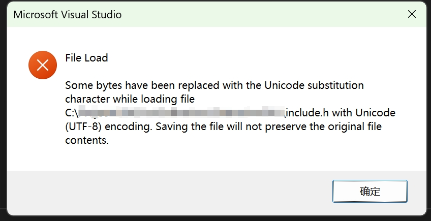

# Visual Studio encoding issue

## View code



```cpp
����...
```

View -> Open With... Select `C++ Source Code Editor (with encoding)` and choose the correct encoding.

## Compile code

The compiler complains
```
Error	C2018	unknown character '0xb9' (compiling source file xxx.cpp)
```

Project Properties(Alt + Enter) -> C/C++ -> Command Line -> Additional Options
Add `/source-charset:gb2312` to support Chinese Simplified characters.
